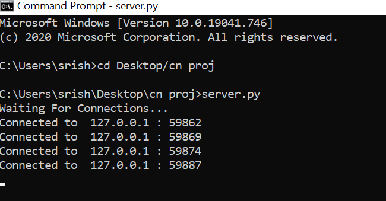
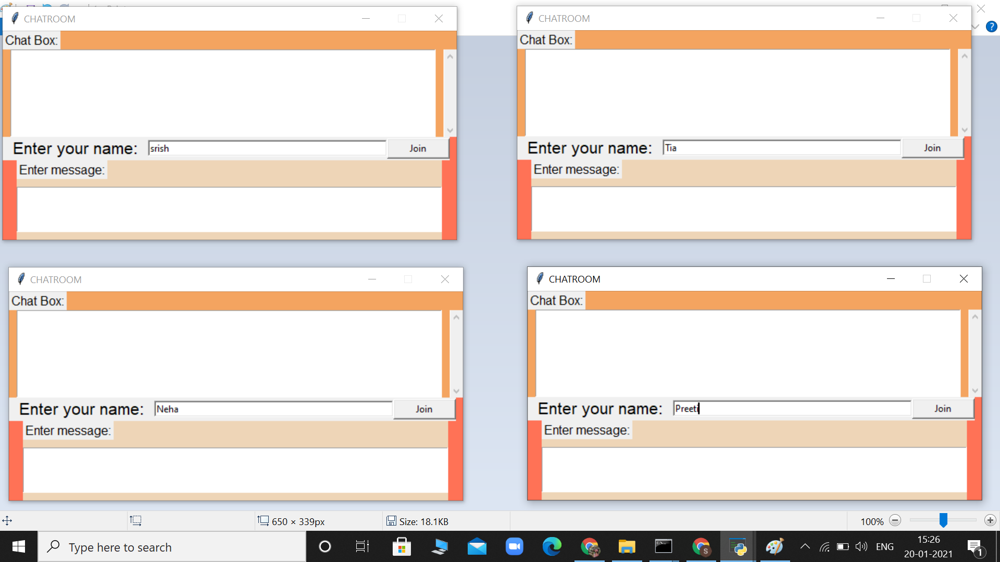
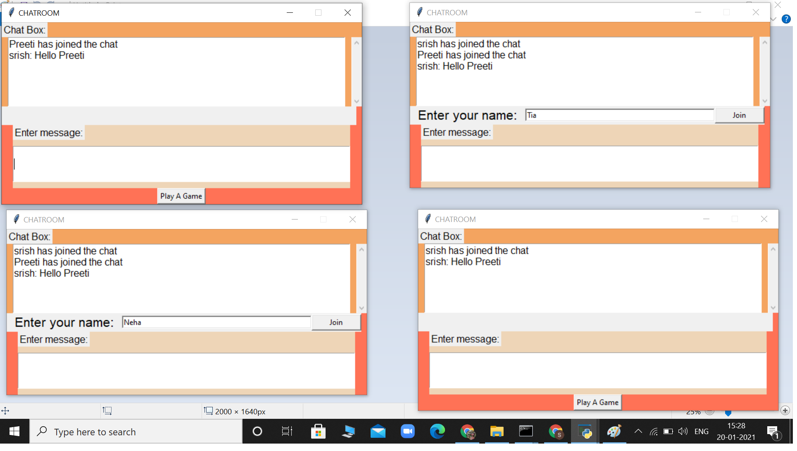
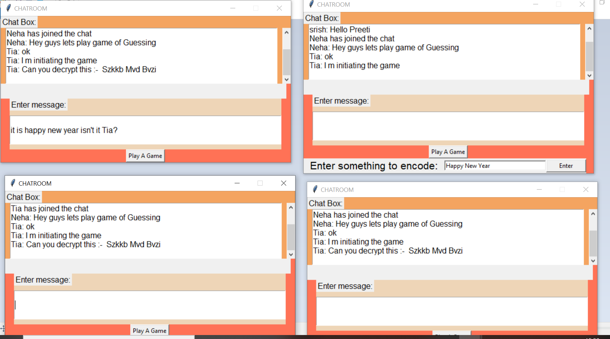
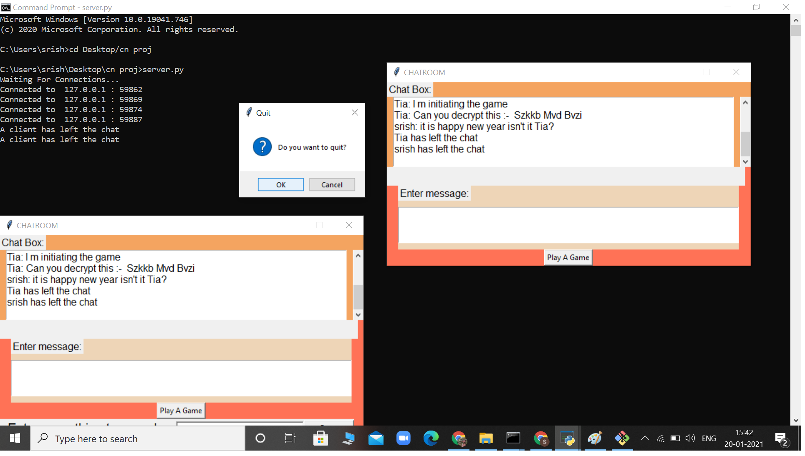

# Chat Application Using Tkinter GUI
### Chat Application is peer-to-peer where the users exchange text messages and files. 
### Chat Application is a software that allows the process of communication, interaction or exchange of information over the network.
### This project is designed using socket programming. It is a desktop application which involves two separate programs one for the client and another for server. 
### The client initiates the chat and once the server receives the message it replies to the client.

  

 

  

 

  

 

  

 

  

 
